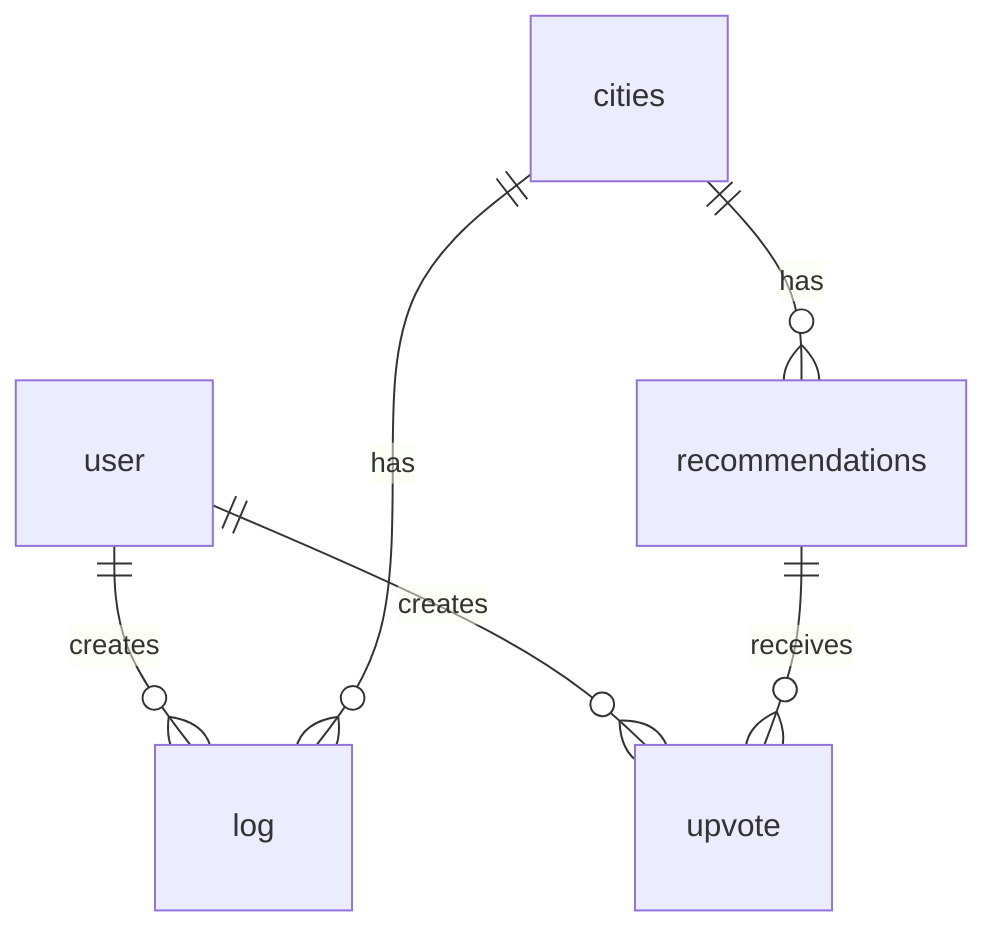

# Database Schema Documentation

## Overview
This document describes the database structure for the Digital Nomad Travel Logging application. The system tracks users, cities they've visited, travel logs, recommendations, and upvotes.

## Entity Relationship Diagram (ERD)


## Tables

### `user`
Stores registered user information.

| Column       | Type   | Description                     |
|--------------|--------|---------------------------------|
| id           | int    | Primary key                     |
| email        | string | Unique user identifier          |
| description  | string | Profile bio (optional)          |
| photourl     | string | URL to profile image (optional) |

### `cities`
Stores city information.

| Column | Type   | Description      |
|--------|--------|------------------|
| id     | int    | Primary key      |
| name   | string | City name        |

### `log`
Records user travel experiences.

| Column    | Type   | Description                          |
|-----------|--------|--------------------------------------|
| id        | int    | Primary key                          |
| title     | string | Log title                            |
| comments  | string | Detailed travel notes                |
| userId    | int    | Foreign key to user                  |
| CityId    | int    | Foreign key to cities                |
| createdAt | date   | When the log was created             |

### `recommendations`
Stores places recommended by users.

| Column    | Type   | Description                     |
|-----------|--------|---------------------------------|
| id        | int    | Primary key                     |
| place     | string | Name of recommended place       |
| CityId    | int    | Foreign key to cities           |

### `upvote`
Tracks user upvotes for recommendations.

| Column            | Type | Description                          |
|-------------------|------|--------------------------------------|
| id                | int  | Primary key                          |
| userId            | int  | Foreign key to user                  |
| recommendationId  | int  | Foreign key to recommendations       |

## Relationships

1. **User to Log**  
   - One-to-many (`user.id` → `log.userId`)  
   - A user can create many travel logs

2. **City to Log**  
   - One-to-many (`cities.id` → `log.CityId`)  
   - A city can have many logs from different users

3. **User to Upvote**  
   - One-to-many (`user.id` → `upvote.userId`)  
   - A user can upvote multiple recommendations

4. **Recommendation to Upvote**  
   - One-to-many (`recommendations.id` → `upvote.recommendationId`)  
   - A recommendation can receive many upvotes

5. **City to Recommendation**  
   - One-to-many (`cities.id` → `recommendations.CityId`)  
   - A city can have many recommended places

## Dbdiagram.io Example

```dbml
table user {
  id int pk 
  email string
  description string 
  photourl string
}
table cities {
  id int pk
  name string
}
table upvote {
  id int 
  userId int
  recommendationId int
}
table recommendations {
  id int pk
  place string
  CityId int 
}
table log {
  id int 
  title string
  comments string
  userId int
  CityId int
  createdAt date 
}

Ref: "recommendations"."CityId" <> "cities"."id"

Ref: "user"."id" < "log"."userId"
Ref: "cities"."id" < "log"."CityId"
Ref: "user"."id" < "upvote"."userId"
Ref: "recommendations"."id" < "upvote"."recommendationId"
```


## Version History
- 1.0 (2025-05-20): Initial schema design
